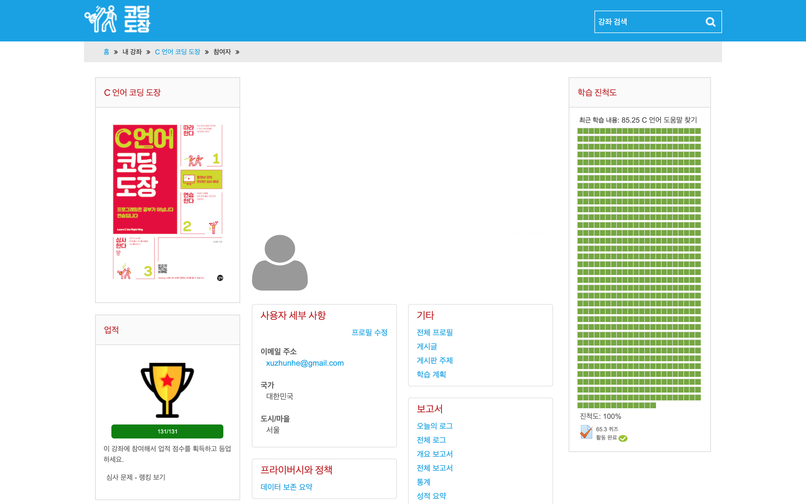

C 언어 코딩 도장
================
https://dojang.io/course/view.php?id=2
--------------------------------------


### Unit 1. 소프트웨어 교육과 C언어
- - -
```
1.1 컴퓨터와 프로그램
1.2 문제 해결을 위한 과학적 사고
1.3 알고리즘과 코딩3 알고리즘과 코딩3 알고리즘과 코딩
1.4 C언어란?
1.5 코딩 도장을 학습하는 방법
프로그래밍 문제의 답안
```

